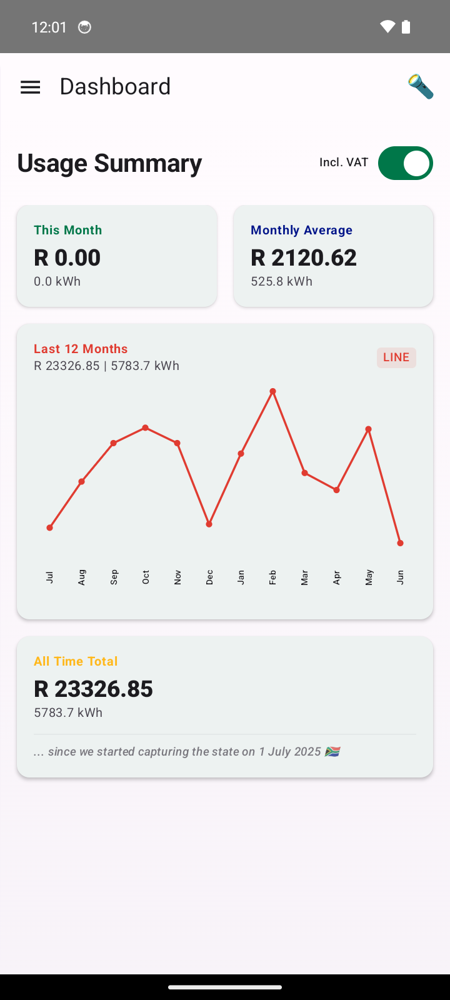
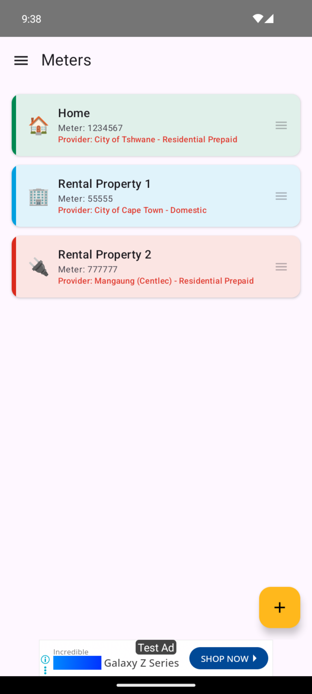
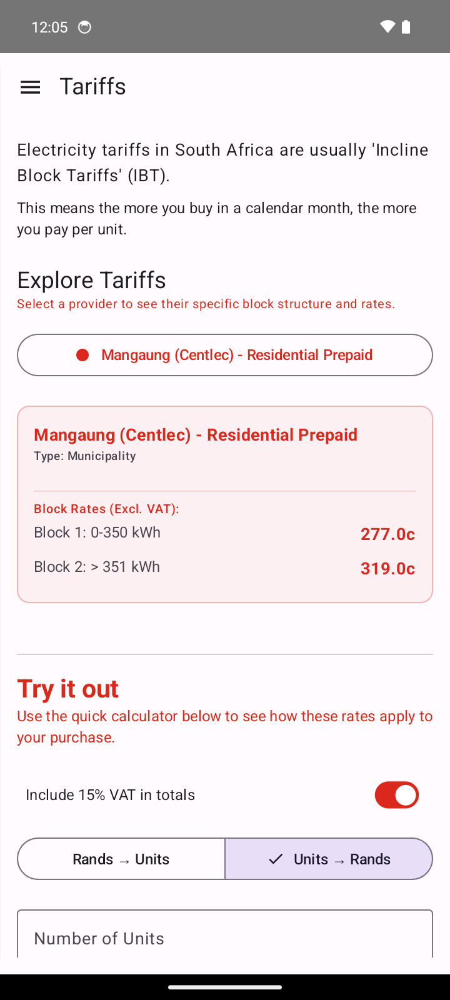
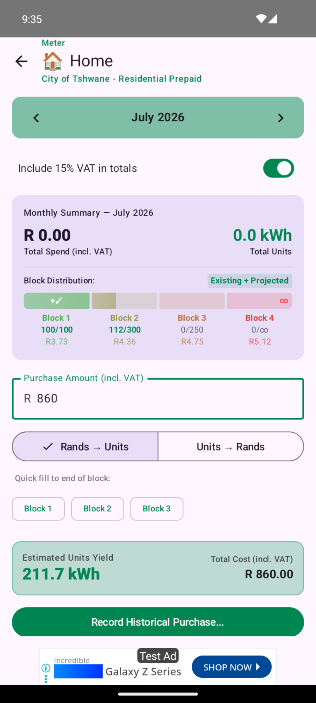
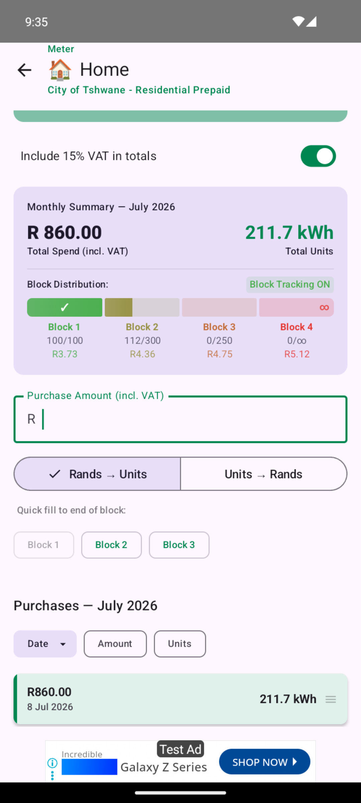
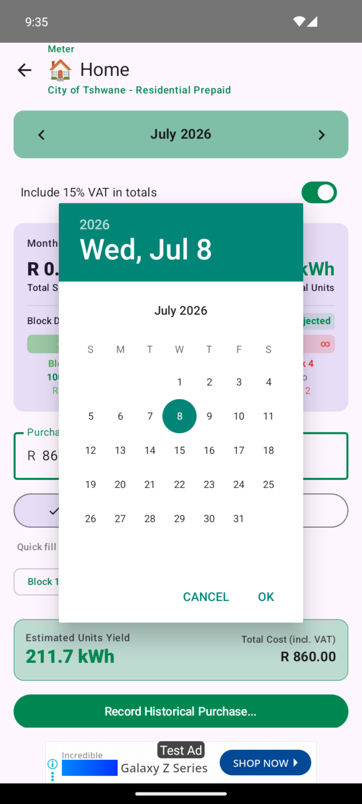
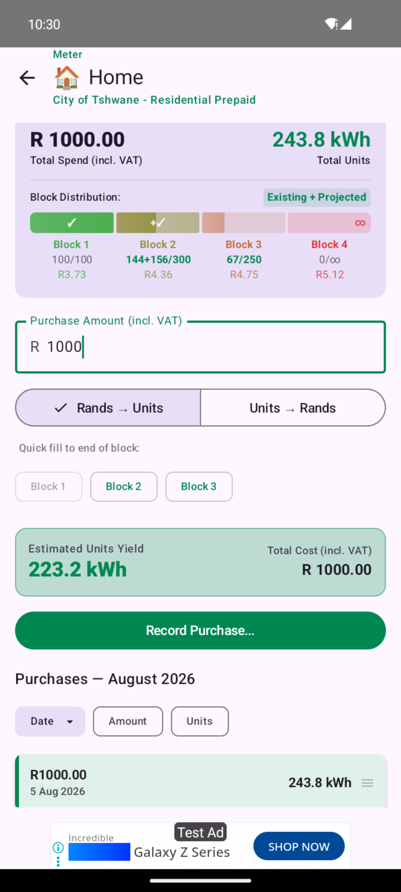
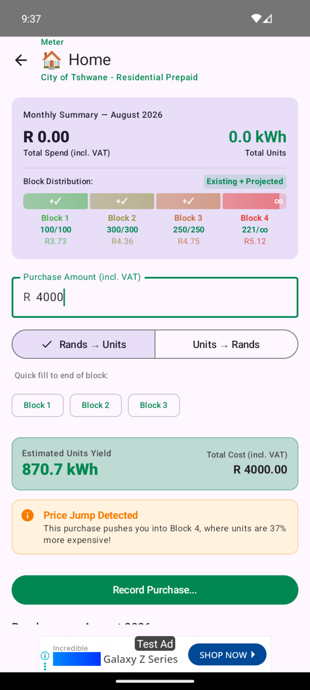
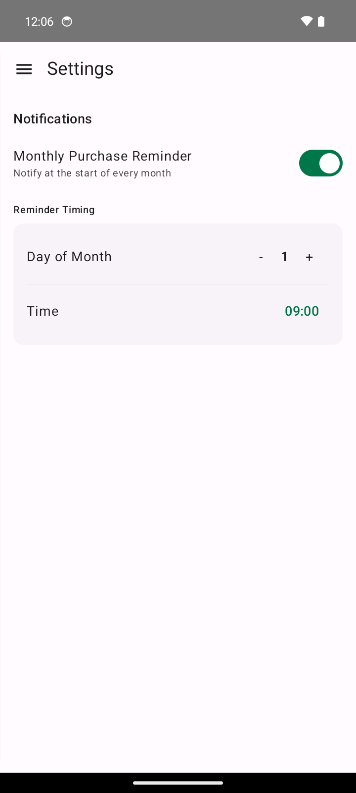
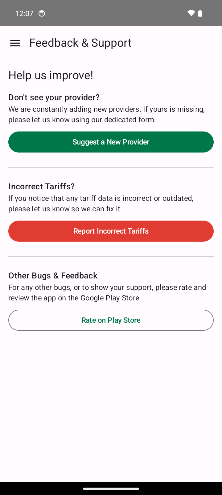

# ⚡ State Capture

> Capture the State of your Prepaid utilities.
> *The official commission of inquiry into your next kilowatt.*

**State Capture** is a modern, premium Android application built to help South African consumers calculate prepaid electricity yields, track cumulative monthly spending, and optimize their utility costs. 

Prepaid electricity in South Africa is sold on a **Block Tariff** (inclined block tariff) structure where the rate per kWh increases the more units you purchase during a calendar month. **State Capture** automatically tracks your purchases, calculates which tier you are currently on, and gives you the exact yield for your next purchase.

---

## 📸 App Screenshots

Below are some previews of the app's clean Material 3 design and features:

| **Dashboard** | **Meter Management** | **Tariff Calculator** |
| :---: | :---: | :---: |
|  |  |  |

| **Monthly Meter Overview** | **Historical Purchases** | **Date Selection** |
| :---: | :---: | :---: |
|  |  |  |

| **Extra Purchase** | **Tier Price Jump** |
| :---: | :---: |
|  |  |

| **Settings & Reminders** | **Feedback & Support** |
| :---: | :---: |
|  |  |

---

## ✨ Features

* **💸 Dynamic Dashboard:**
  * View total spend and unit yields across four timeframes:
    * **This Month** 💸
    * **Last 12 Months** 📈
    * **All Time** 🕰️
    * **Monthly Average** 🤌
* **📊 Step-Tariff Engine:**
  * Accounts for cumulative purchases in the current month to correctly calculate tier-based yield.
  * Displays a full breakdown of how your purchase is split across tariff blocks.
* **📅 Historical Purchase & Custom Date Support:**
  * Log purchases for prior dates/months with automatic tariff period matching.
  * View detailed monthly meter breakdowns, past purchase history, and price jump indicators when stepping into higher tariff tiers.
* **📅 Time-Based Tariffs:**
  * Resolves tariffs automatically using the purchase date (e.g. matching 2025/2026 or 2026/2027 billing periods).
* **⚡ Multi-Meter Management:**
  * Create, edit, and delete multiple profiles/meters (e.g., "Home", "Holiday House").
  * Customize each meter with distinct names, meter numbers, and custom emojis.
  * Drag-and-drop to rearrange your meter list.
* **🔦 Integrated Flashlight:**
  * Quick toggle for the device flashlight at the top right of the dashboard—perfect for checking physical meters in dark environments or during loadshedding.
* **🔔 Smart Reminders:**
  * Schedule a reminder notification to trigger at the start of every month to reset your blocks and log purchases.
* **🔄 Synchronized Tariff Database:**
  * Periodically pulls and caches up-to-date tariff JSON configurations from a public repository.
* **📢 Feedback and Contributions:**
  * Suggest missing municipalities or submit updates for incorrect tariff data.

---

## 🛠️ Technology Stack

* **Language:** Kotlin 1.9.22
* **UI Framework:** Jetpack Compose (using Material Design 3 guidelines)
* **Architecture:** MVVM (Model-View-ViewModel) + Clean Architecture
* **Database:** Room Database (via Kotlin Symbol Processing - KSP)
* **Local Storage:** Jetpack DataStore Preferences (for settings and configuration)
* **JSON Serialization:** Kotlinx Serialization
* **Network Client:** Retrofit 2
* **Background Processing:** WorkManager & AlarmManager (for start-of-month notifications)
* **Monetization:** Google Mobile Ads (AdMob) Integration

---

## 📂 Project Structure

```text
app/src/main/java/za/co/statecapture/android/
├── MainActivity.kt            # Main entry point and Sidebar Navigation container
├── data/
│   ├── AppDatabase.kt         # Room Database configuration
│   ├── Meter.kt               # Room Entity for meters
│   ├── Purchase.kt            # Room Entity for purchases
│   ├── TariffConverters.kt    # Room type converters (for periods & blocks)
│   ├── TariffDao.kt           # DAO for cached tariff providers
│   ├── TariffProviderEntity.kt# Room Entity for tariff data caching
│   └── repository/
│       ├── SettingsRepository.kt  # Reads/writes DataStore preferences
│       └── TariffRepository.kt    # Loads local/remote JSON configurations
├── domain/
│   └── model/                 # Domain representation of Tariff blocks and calculations
├── notification/              # AlarmReceiver & Notification Workers for reminders
├── ui/
│   ├── AppViewModelFactory.kt # ViewModel Provider Factory
│   ├── theme/                 # Material 3 Color Schemes & Typography
│   └── [screens]/             # UI screens (Dashboard, Meters, Tariffs, Settings, Feedback, etc.)
└── util/                      # Helpers (e.g., Flashlight manager)
```

---

## 🗂️ Tariff Data JSON Schema

The app now uses a modular, downloadable tariff system hosted remotely. The root configuration is defined in an `index.json` file which points to individual tariff JSON files for each year and provider.

### `index.json` Schema
```json
{
  "last_updated": "2026-06-10",
  "plans": [
    {
      "id": "tshwane_prepaid",
      "name": "City of Tshwane - Residential Prepaid",
      "type": "municipality",
      "color": "#008751",
      "provider_id": "tshwane",
      "files": [
        {
          "valid_from": "2026-07-01",
          "valid_to": "2027-06-30",
          "path": "2026/tshwane.json"
        }
      ]
    }
  ]
}
```

### Provider Schema (e.g. `2026/tshwane.json`)
```json
{
  "id": "tshwane",
  "name": "City of Tshwane",
  "official_url": "https://www.tshwane.gov.za",
  "tariffs": [
    {
      "id": "tshwane_prepaid",
      "name": "City of Tshwane - Residential Prepaid",
      "type": "municipality",
      "color": "#008751",
      "periods": [
        {
          "valid_from": "2026-07-01",
          "valid_to": "2027-06-30",
          "fixed_monthly_charge_cents": 0,
          "blocks": [
            { "min_kwh": 0, "max_kwh": 100, "rate_per_kwh_cents": 324.12 },
            { "min_kwh": 101, "max_kwh": 400, "rate_per_kwh_cents": 379.32 },
            { "min_kwh": 401, "max_kwh": 650, "rate_per_kwh_cents": 413.27 },
            { "min_kwh": 651, "max_kwh": 999999, "rate_per_kwh_cents": 445.51 }
          ]
        }
      ]
    }
  ]
}
```

---

## ⚙️ Building the Application

### Prerequisites
* JDK 17
* Android SDK 35 (Platform tools, Build tools)
* Gradle 8.2+

### 1. Configure Signing Credentials
Create a file named `keystore.properties` in the root project directory:
```properties
storeFile=statecapture-upload.jks
storePassword=your_keystore_password
keyAlias=your_key_alias
keyPassword=your_key_password
```

### 2. Compile and Build
Build the debug APK using the Gradle Wrapper:
```bash
./gradlew assembleDebug
```

To run unit tests:
```bash
./gradlew test
```

---

## ⚖️ Disclaimer
*State Capture is provided free of charge, "as is," without any warranties, guarantees, or liabilities. All calculations are estimations. Please cross-verify your municipality's rates if you experience discrepancies.*
